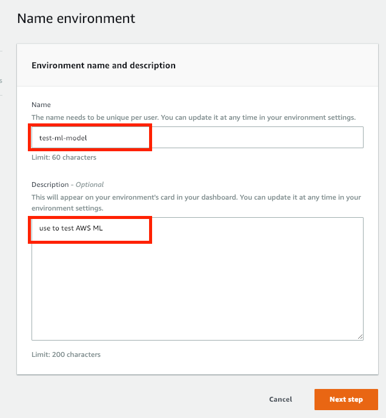
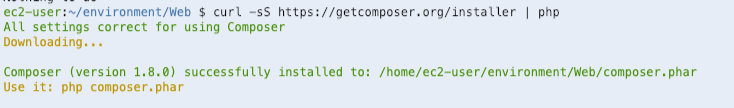

Build recommendation engine with Amazon Machine Learning in Cloud9
==============================================================

## Scenario
In this lab, you will build a solution using [Amazon S3](https://aws.amazon.com/s3/) , [Amazon Machine Learning](https://aws.amazon.com/machine-learning/) and [Amazon Cloud9](https://aws.amazon.com/tw/cloud9/) that predict rental bikes for Capital bike-share system. The dataset contains the daily amount of rental bikes between years 2011 and 2012 in the Capital bike-share system with the corresponding weather and seasonal information. You will learn how to use S3 to save data and predict using Machine Learning to create a model that will predict the rental bikes.

## Prerequisite
- Make sure the region is __US East (N. Virginia)__, which its short name is __us-east-1__.

## Lab tutorial
### Upload dataset file to S3 bucket
- On the service menu, click __S3__, Click __Create Bucket__.

- For Bucket Name, type __Unique Name__.

- For Region, choose __US East (N. Virginia)__, Click __Create__.

- Select the bucket which you created before, Click __Upload__, Click __Add files__.

- Select the __bike.csv__ file, then choose Click __Start Upload__.

### Create Model using Amazon Machine Learning
- On the service menu, click __Machine Learning__.

- Click __Get Started__ and __Launch__.

- For __Where is your data__, choose __S3__.

- For __S3 location__, choose the s3 bucket location/file which you created.

- For __Datasource name__, type __ml‐data__, Click __Verify__.

- For __S3 permissions__, click __yes__.

> Note: You will see ‘The validation is successful. To go to the next step, choose Continue’

- Click __Continue__.

- In __Schema__ part:
    1. About the first line in the column name, click __yes__ when you see the question: Does the first line in your CSV contain the column names?
    2. For Datatype, choose season/mnth/weekday/workingday/weathersit as __Categorical__
    3. For Datatype, choose cnt as __Numetric__.
    
    
    4. Click __Continue__.

- In __Target__ part:
    1. For target, choose __cnt__ as target for prediction.
    2. Click __Continue__.

- In __Row ID__ part, click __Review__.

- In __Review__ part, click __Continue__.

- In __ML model settings__ part, click __Review__.

- In __Review__ part, 
    1. Click __Create ML Model__.
    2. Wait for Amazon ML reports the status as __Completed__.
    

    3. Note your model __ID__.

- In Predictions section, click __Create endpoint__ to enable real-time predictions.

- For __Create a real-time endpoint__ dialog, click __Create__.

- Note your real-time prediction __Endpoint Url__.

### Test Model in Web page using Cloud9
- On the service menu, click __Cloud9__, click __Create environment__.

- Enter the followings:
    1. Name : __test-ml-model__
    2. Describe : use to test AWS ML
    

- Click __Next step__.

- In __Environment settings__ part:
    1. Environment type : Choose __Create a new instance for environment (EC2)__.
    2. Instance type : Choose __t2.micro (1 GiB RAM + 1 vCPU)__.
    

- Click __Next step__.

- At __Review__ page, click __Create environment__.

- You will see the page like below.

- Please download the __Web__ folder in this tutorial. 

- In the navigation pane, click __File__ and choose __Select folder__.

- Choose the folder __Web__ you download before.

- Copy below command and paste into terminal to update packges.
    
      sudo yum -y update

    

- Enter the command in terminal to change folder to __Web__.

      cd Web

- Enter the command in terminal to install php packge.

      sudo yum -y install php56

    

- Enter the command in terminal to install composer.

      curl -sS https://getcomposer.org/installer | php

    

- Enter the command in terminal to install __AWS SDK for PHP__.

      php composer.phar require aws/aws-sdk-php

- Open the __regression.php__ in console.

- At line 118 and 119, paste __your model id__ and __your predict endpoint__ here.

- At line 164, paste __your model id__ here.

- In the navigation pane, click __Run__ and choose __Run Configurations__.

- Choose __New Run Configuration__.

- In __Command__ field, enter the following :
       
      Web/regression.php

- In __Runner__ part, choose __PHP (built-in web server)__.

- Click green button __Run__.

- In the navigation pane, click __Review__ and choose __Preview Running Application__.

- You will see the page like below.

- Add the following behind the __/__.

      Web/regression.php

- You will see the below page.

- Click __Predict__, you will see the predict result.

## Conclusion
Congratulations! We now have learned how to:
- Build a simple model using AWS Machine Learning
- Create a S3 bucket to save dataset
- Use Cloud9 to run php application
